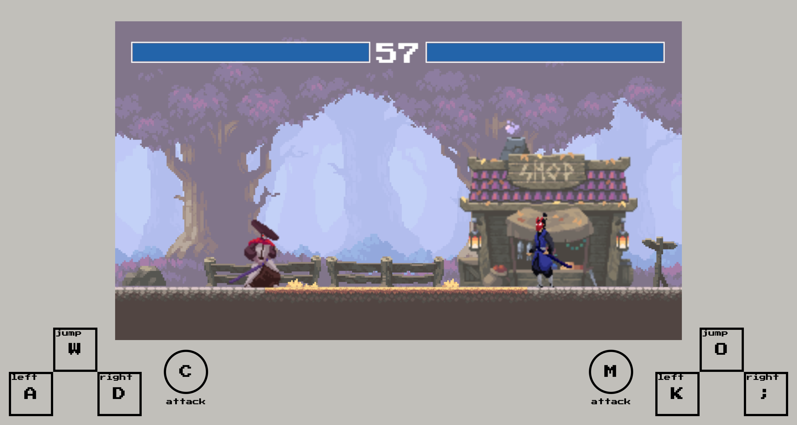

# Fun with html5 canvas - fighting game

## Table of contents
  - [Overview](#overview)
    - [The challenge](#the-challenge)
    - [Screenshot](#screenshot)
    - [Links](#links)
  - [My process](#my-process)
    - [Built with](#built-with)
    - [What I learned](#what-i-learned)
    - [Continued development](#continued-development)
    - [Useful resources & Acknowledgments](#useful-resources-&-acknowledgments)

## Overview

### The challenge

Users should be able to:

- press the corresponding key to move character.
- press the corresponding key to attack other character.
- press the corresponding key to jump.
- refresh the game via click the return button when any character die, or when the time is running out.

### Screenshot

### Links

- [Solution URL](https://github.com/Beginneraboutlife116/JS30-08-html5-canvas)
- [Live Site URL](https://beginneraboutlife116.github.io/JS30-08-html5-canvas/)

## My process

### Built with

- Semantic HTML5 markup
- CSS custom properties
- Flexbox
- CSS Grid
- a11y-dialog

### What I learned

Although this canvas game idea was from a [youtube](https://www.youtube.com/watch?v=vyqbNFMDRGQ), made by [Chris Courses](https://www.youtube.com/c/ChrisCourses), I  still learned how to use html5 canvas and how to change the frame to make characters or view switching.

There are lots of method and properties could be used:
- `Window.requestAnimationFrame()`
- `CanvasRenderingContext2D.drawImage()`

In this practice, except the keyboard decorations, all of the things showing on the canvas are made by canvas methods.
- Like character life value.
- The got damage animation.
- The clock, and counting.
- 
### Continued development

I would try to make a fighting game by myself, and the topic would may be alpaca, because I could use [this idea](https://www.codementor.io/projects/web/alpaca-image-generator-website-ce2oc0eus8) to make choosing character view.

And also it will be a SPA created by React, I believed.

There are few features, like:
1. User could change the keyboard setting, it means that would have a setting page.
2. User could choose the favorite alpaca character, and even save it, it means that I need to record the use info to maintain the character style.

### Useful resources & Acknowledgments

- [JavaScript Fighting Game Tutorial with HTML Canvas](https://www.youtube.com/watch?v=vyqbNFMDRGQ) - This helped me for understanding how to build a canvas fighting game from zero to finish.
- [Oak Woods — Environment Asset 🍂](https://brullov.itch.io/oak-woods) - These are the resources of the background, shop, kenji, samuraiMack img. You could support this!!
- MDN for canvas.
- The refresh button is referred to Kevin Powell's youtube: [Create borders with cut corners | fully responsive CSS and easy to adapt](https://www.youtube.com/watch?v=aW6qEAQSctY&t=228s)